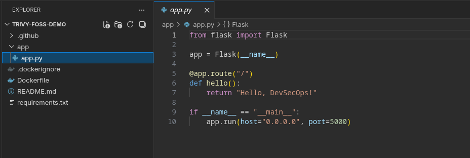
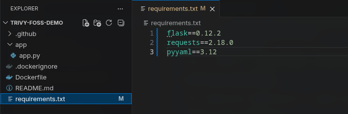
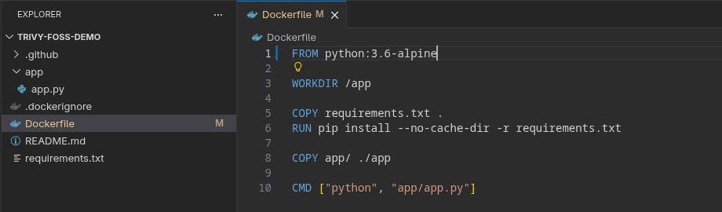
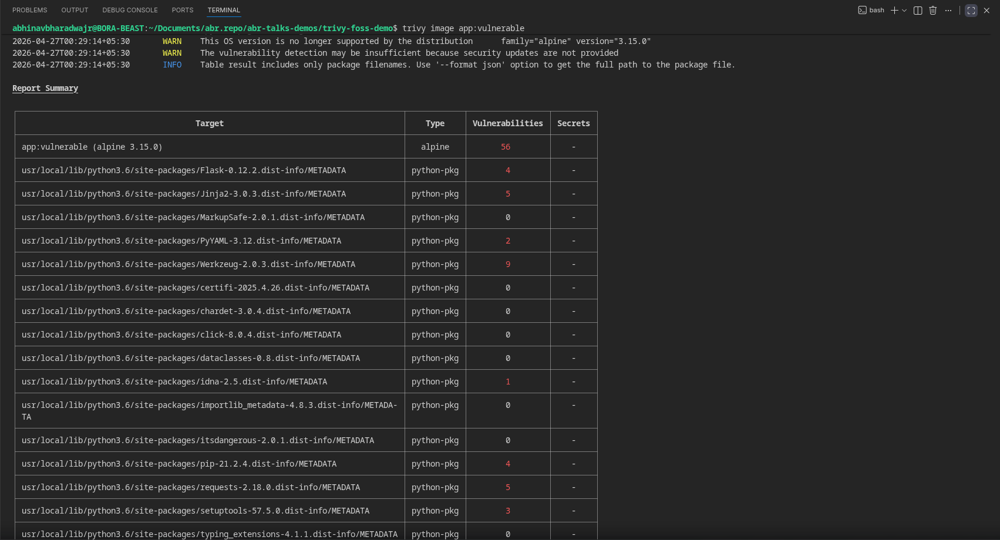
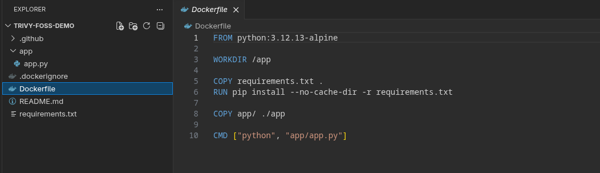
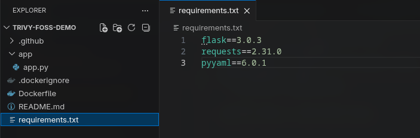
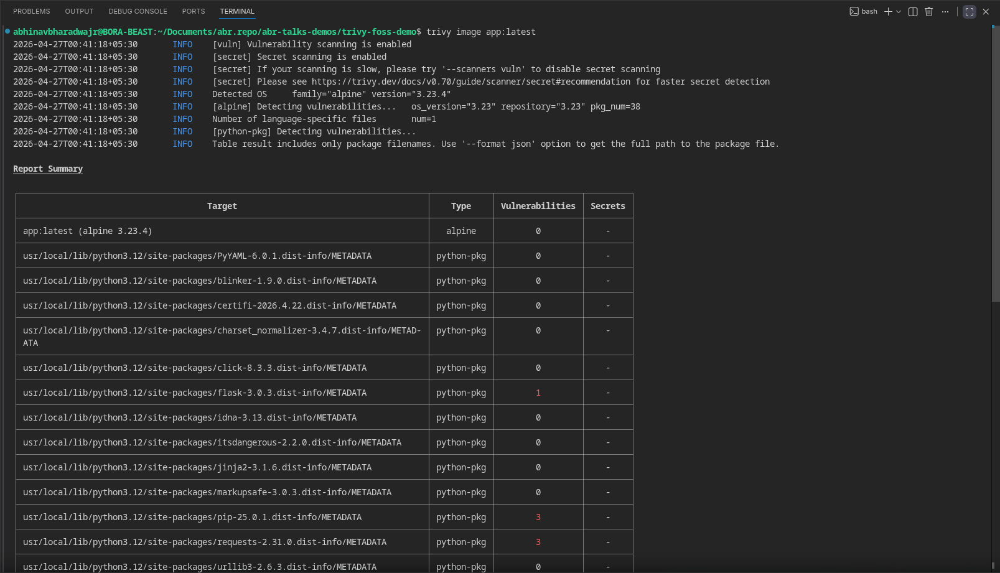
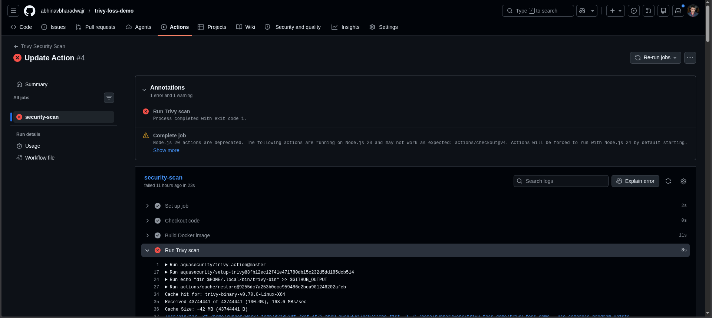
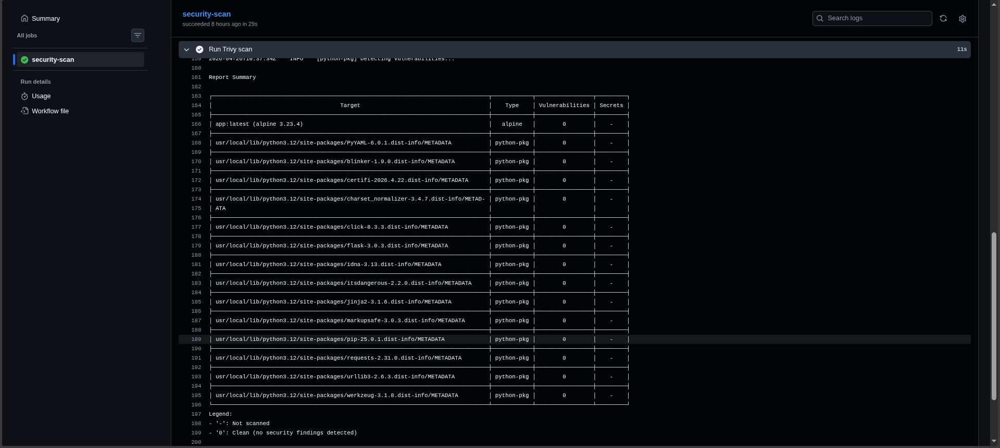

# 🚀 Shift Left Without the Pain

### Turning Security into a DevOps Habit with Open Source

Modern DevOps pipelines are optimized for speed.

But are we shipping secure systems —
or just deploying vulnerabilities faster?

This repository accompanies my talk at **FOSSUnited Bengaluru (April 2026)**, where I demonstrate how to integrate security directly into CI/CD pipelines using open-source tools like Trivy.

## 🎯 What You'll Learn

* Scan container images for vulnerabilities using Trivy
* Identify and fix common security issues (base images & dependencies)
* Integrate security checks into CI/CD pipelines
* Fail builds automatically on HIGH/CRITICAL vulnerabilities
* Adopt DevSecOps practices without adding friction

## ⚠️ The Problem

In most real-world pipelines, security is treated as a final step:

```
Build → Test → Deploy → (Maybe) Security Scan
```

By the time vulnerabilities are discovered:

* They are expensive to fix
* They are risky to patch
* They are often ignored

👉 Security becomes a **bottleneck**, not a capability.

## 🤔 Why Shift-Left Often Fails

“Shift left” sounds great in theory — but execution is where things break.

Common challenges:

* Too many tools and dashboards
* Complex setup and configuration
* Alert fatigue and false positives
* No developer-friendly feedback loop

When tools cry wolf too often, developers start ignoring everything — including real issues.

## 🛠️ The Approach

Instead of adding more tools, we aim for:

* Minimal setup
* Zero friction
* Native CI/CD integration

👉 **One tool. One step. No overhead.**

This is where **[Trivy](https://trivy.dev)** comes in.

## 🔍 Demo Walkthrough

This repository demonstrates a simple workflow:

**Scan → Fix → Enforce**

### 🧪 Step 1: Build a Vulnerable Image
---

Let's take a simple app with some know vulnerabilities for our case.





#### Dockerfile :



#### Build the app

```bash
docker build -t app:vulnerable .
```

This uses:

* An outdated base image
* Vulnerable dependencies

### 🔍 Step 2: Scan with Trivy
---

```bash
trivy image app:vulnerable
```



You’ll see:

* CVEs (vulnerabilities)
* Severity levels (CRITICAL, HIGH, etc.)
* Fixed versions

👉 These vulnerabilities already exist — even if your code is “clean”.

### 🔧 Step 3: Fix the Issues
---

Update:

##### Base image (e.g., Python version)



##### Dependencies in `requirements.txt`



### 🔄 Step 4: Re-scan
---

```bash
trivy image demo-app:latest
```



👉 You should now see significantly fewer (or zero critical) vulnerabilities.

### ⚙️ Step 5: Enforce in CI/CD
---

You can also integrate Trivy into your GitHub Actions workflow:

```
.github/workflows/trivy.yml
```

```
name: Trivy Security Scan

on:
  push:
    branches: [ "main" ]

jobs:
  security-scan:
    runs-on: ubuntu-latest

    steps:
      - name: Checkout code
        uses: actions/checkout@v4

      - name: Build Docker image
        run: docker build -t app:latest .

      - name: Run Trivy scan
        uses: aquasecurity/trivy-action@master
        with:
          image-ref: 'app:latest'
          format: 'table'
          exit-code: '1'
          severity: 'CRITICAL,HIGH'
          ignore-unfixed: true
```

It:

* Builds the Docker image
* Runs Trivy scan
* Fails the pipeline on HIGH/CRITICAL vulnerabilities

```yaml
exit-code: '1'
severity: 'HIGH,CRITICAL'
```

👉 This turns security into a **gate**, not a report.

##### A pipline after Trivy Scan fails to meet the specified conditions :



##### A successfull pipeline :



### 📊 Before vs After

| Stage      | Result            |
| ---------- | ----------------- |
| Before Fix | ❌ Pipeline fails  |
| After Fix  | ✅ Pipeline passes |

## 🔐 Reality Check

Tools don’t replace judgment.

* Not all CVEs are exploitable
* False positives exist
* Trivy won’t catch application logic bugs (e.g., SQL injection)
* Security policies must be defined by your team

Use `.trivyignore` to document and suppress acceptable risks.

👉 Running Trivy is the **start of a conversation**, not the end.

## 🛠️ Best Practices

* Start small — scan one service first
* Fail only on HIGH/CRITICAL vulnerabilities initially
* Use `.trivyignore` with justification
* Scan on pull requests, not just main branch
* Keep your base images updated
* Keep Trivy and its DB up to date

## ⚡ Try It Yourself (Quick Start)

📂 Head over to the repository here [trivy-foss-demo](https://github.com/abhinavbharadwajr/trivy-foss-demo)


```bash
# Clone the repo
git clone https://github.com/abhinavbharadwajr/trivy-foss-demo.git .

# Build vulnerable image
docker build -t app:vulnerable .

# Scan image
trivy image app:vulnerable

# Fix Dockerfile + dependencies

# Rebuild
docker build -t app:latest .

# Re-scan
trivy image app:latest
```

## 🎯 Key Takeaway

Security doesn’t need to be complex.

With the right approach, you can turn your CI/CD pipeline into a system that:

👉 **Actively prevents vulnerable code from being deployed**
👉 **Uses only open-source tools**
👉 **Fits naturally into your existing workflow**

## 📎 Resources

* 📊 Presentation Slides (PDF)
* 🔐 Trivy Documentation: https://github.com/aquasecurity/trivy

## 🙌 Acknowledgements

Thanks to the [FOSSUnited's](https://fossunited.org/) - [Bengaluru community](https://fossunited.org/c/bengaluru/apr-2026) for the opportunity to present and share this work.

## 👋 Connect

If you found this useful or have suggestions, feel free to connect or open an issue!
